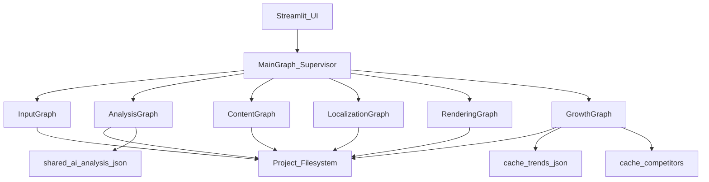

# Architecture Diagram — Nested Creator OS

## Overview

The AI Creator Platform uses a **Main Graph supervisor** that orchestrates six pipeline subgraphs. Agents remain intact; large payloads live on disk; graph state carries **paths** (plus dual-write packs during migration).

## Main Graph

Coarse sequence: `input_pipeline` → `analysis_pipeline` → `content_pipeline` → `localization_pipeline` → `render_pipeline` → `growth_pipeline` → END.

Supervisor duties: soft-skip gates, feature flags, resume/checkpoint thread continuity.

## Compatibility

`build_video_graph` / `run_video_workflow` remain public. Nested compile is the preferred path; flat wiring is preserved as an internal fallback during migration.
